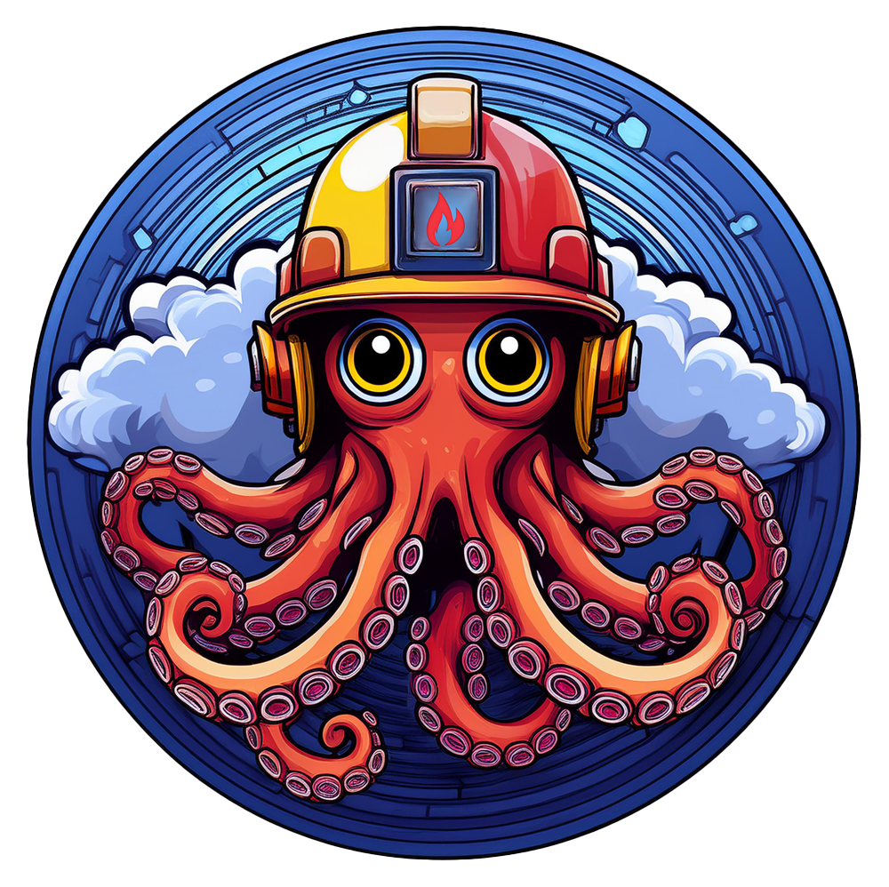

# Incident Bot

An incident management framework centralized around a ChatOps bot to allow your teams to easily and effectively identify and manage technical incidents impacting your cloud infrastructure, your products, or your customers' ability to use your applications and services.

[Incident Bot's Documentation](https://docs.incidentbot.io)

**NOTICE:** As of February 2nd, 2025, the Helm charts repository has moved from https://charts.incidentbot.io to https://docs.incidentbot.io/charts - please update your usage accordingly.

- [Incident Bot](#incident-bot)
  - [Features](#features)
  - [Quick Start](#quick-start)
  - [Contributing](#contributing)
  - [Feedback](#feedback)

## Features

- Organize your efforts into Slack channels to coordinate incident response
- Easy to read messages that get to the point without a ton of visual distractions
- Completely customizable status, severity, and role definitions to control all stages of incident response
- Communicate with the bot using ephemeral messages to keep clutter out of your channels
- Keep the rest of your organization informed with an incident digest channel that explains the state of all incidents
- Integrate with tools you already use like Confluence, Jira, Opsgenie, Statuspage, PagerDuty, and Zoom
- Automatically build a postmortem document base to save time
- A web interface for advanced features and organizational capabilities [TBD]

Interested in a web interface to use with Incident Bot? Check out the console project [here](https://github.com/incidentbot/console).

## Quick Start

- [Create a Slack app](https://api.slack.com/apps?new_app=1) for this application. You can name it whatever you'd like.
- Select `from an app manifest` and copy `manifest.yaml` out of this repository and paste it in to automatically configure the app and its required settings. Be sure to override any customizable settings like name, etc.
- You'll need the app token, bot token, and user token for your application and provide those as the `SLACK_APP_TOKEN`, `SLACK_BOT_TOKEN`, and `SLACK_USER_TOKEN` environment variables - these can be found within the app's configuration page in Slack. For more information on Slack tokens, see the documentation [here](https://api.slack.com/authentication/token-types).
- You'll need a Postgres instance to connect to. If trying the bot out using Docker Compose or Helm, there are options to run a database alongside the app.
- Configure and deploy the application using one of the methods described in the documentation, or however you choose. (There's a Docker image available.)

Full setup documentation is available [here](https://docs.incidentbot.io/installation/).

## Contributing

Please see [contribution guidelines](https://github.com/incidentbot/incidentbot/blob/main/CONTRIBUTING.md) before opening a pull request.

## Feedback

This application is not meant to solve every problem with regard to incident management. It was created as an open-source alternative to paid solutions.

If you encounter issues with functionality or wish to see new features, please open an issue or a feature request to let us know.
