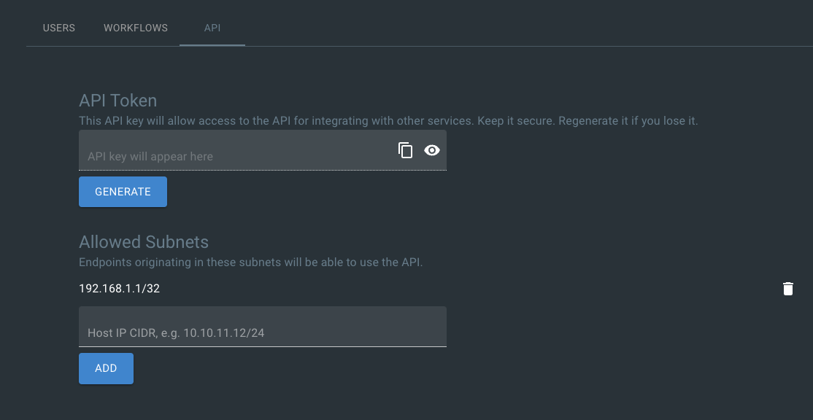

# Configuration

## Application Configuration

All application settings are configured using environment variables/secrets for sensitive values and `config.yaml` for everything else.

You can call this file whatever you'd like, but by default it's called `config.yaml`. An example is provided at the backend root.

You can change the following settings in this file:

- The incident digest channel
- Role definitions - you can create and define your own roles which will show up as claimable or assignable roles during incidents
- Severity definitions - you can create and define your own severity definitions which will be available to set on all incidents
- Status definitions - you can create and define your own status definitions which will be available to set on all incidents

These are viewable in Slack and in the web UI.

You can also set:

- The default incident channel topic
- The application's timezone for timestamps, timeline creation, etc.
- The default conference bridge link if not using Zoom auto create
- The ability to create incidents from reactions
- Groups to be automatically invited to new incidents
- Links that are provided as helpful guidelines in messages and modals

Lastly, you can also adjust integrations:

- Confluence
- Jira
- PagerDuty
- Statuspage
- Zoom
- Google Meet

Here is the standard layout of the file:

```yaml
  # Options: slack
  platform: slack
  # The channel where incident activity is logged
  digest_channel: incidents
  # Roles defined here will appear as options for each incident
  roles:
    incident_commander: "The Incident Commander is the decision maker during a major incident, delegating tasks and listening to input from subject matter experts in order to bring the incident to resolution. They become the highest ranking individual on any major incident call, regardless of their day-to-day rank. Their decisions made as commander are final.\\n\\nYour job as an Incident Commander is to listen to the call and to watch the incident Slack room in order to provide clear coordination, recruiting others to gather context and details. You should not be performing any actions or remediations, checking graphs, or investigating logs. Those tasks should be delegated.\\n\\nAn IC should also be considering next steps and backup plans at every opportunity, in an effort to avoid getting stuck without any clear options to proceed and to keep things moving towards resolution.\\n\\nMore information: https://response.pagerduty.com/training/incident_commander/"
    communications_liaison: "The purpose of the Communications Liaison is to be the primary individual in charge of notifying our customers of the current conditions, and informing the Incident Commander of any relevant feedback from customers as the incident progresses.\\n\\nIt's important for the rest of the command staff to be able to focus on the problem at hand, rather than worrying about crafting messages to customers.\\n\\nYour job as Communications Liaison is to listen to the call, watch the incident Slack room, and track incoming customer support requests, keeping track of what's going on and how far the incident is progressing (still investigating vs close to resolution).\\n\\nThe Incident Commander will instruct you to notify customers of the incident and keep them updated at various points throughout the call. You will be required to craft the message, gain approval from the IC, and then disseminate that message to customers.\\n\\nMore information: https://response.pagerduty.com/training/customer_liaison/"
  # Severities defined here will appear as options for each incident
  severities:
    sev1: 'This signifies a critical production scenario that impacts most or all users with a major impact on SLAs. This is an all-hands-on-deck scenario that requires swift action to restore operation. Customers must be notified.'
    sev2: 'This signifies a significant production degradation scenario impacting a large portion of users.'
    sev3: 'This signifies a minor production scenario that may or may not result in degradation. This situation is worth coordination to resolve quickly but does not indicate a critical loss of service for users.'
    sev4: 'This signifies an ongoing investigation. This incident has not been promoted to SEV3 yet, indicating there may be little to no impact, but the situation warrants a closer look. This is diagnostic in nature. This is the default setting for a new incident.'
  # Whether or not to deliver incident update reminders for critical incidents
  # This will send out a reminder message to an active incident channel at the supplied
  # interval
  incident_reminders:
    # Any severity in this list will have a scheduled reminder job created
    # This job will remind the channel to send out updates at the interval
    # specified rate below
    qualifying_severities:
      - sev1
    # rate determines how often reminders are sent to an incident channel
    # This is an int and is interpreted as minutes
    rate: 30
  # Statuses defined here will appear as options for each incident
  statuses:
    - investigating
    - identified
    - monitoring
    - resolved
  options:
    # The topic that will be set on all incident channels
    channel_topic:
      default: 'This is the default incident channel topic. You can edit it in settings.'
      # If set to true, set the channel topic to the meeting link. This will override incident_channel_topic.
      # set_to_meeting_link: true
    # Timezone to use for logging, etc.
    timezone: UTC
    # If not using Zoom auto-create
    conference_bridge_link: 'https://zoom.us'
    # Allow creation of an incident by reacting to a message
    create_from_reaction:
      # Set to true to enable
      enabled: false
      # The name of the reacji
      # It must exist in your workspace
      reacji: create-incident
    # Automatically invite Slack groups to newly created incidents
    auto_invite_groups:
      # Set to true to enable
      enabled: false
      # List of group names as configured in Slack
      groups:
        - my-slack-group
        - my-other-slack-group
  integrations:
    # Secret data is provided as environment variables for integrations
    # Only non-secret data is configured here
    # Simply provide an empty dict to enable PagerDuty
    # pagerduty: {}
    # Enable Confluence integration
    atlassian:
      confluence:
        # Set to true to automatically create an RCA doc
        auto_create_rca: false
        space: ENG
        parent: Postmortems
      # Enable Jira integration
      jira:
        project: my-jira-project-name
        labels:
          - incident-management
          - etc
    # Enable Statuspage integration
    statuspage:
      # The public URL of the Statuspage.
      url: https://status.mydomain
      # Which Slack groups have permissions to manage Statuspage incidents?
      # If not provided, everyone can manage Statuspage incidents from Slack.
      permissions:
        groups:
          - my-slack-group
      # Enable Zoom integration
    zoom:
      # Set to true to automatically generate a Zoom meeting for each incident
      auto_create_meeting: false
      # Enable Google Meet integration
    google_meet:
      # Set to true to automatically generate a Google Meet meeting for each incident
      auto_create_meeting: false
  links:
    incident_guide: https://changeme.com
    incident_postmortems: https://changeme.com
```

Any time you'd like to change these settings, adjust them here and provide them to the app. In most cases this can be done by mounting the config file to a path and then setting that path to the value of the environment variable `CONFIG_FILE_PATH`.

## API Configuration

The bot has an API that can be used to create incidents with an API key. This is useful for creating incidents from external sources.

To start, create an API key:



Once you've created a key, you can view it and copy it:


You can use this key to send a request to create an incident:

```bash
curl -X POST http://mybot.domain/api/v1/incident/ext \
  -H 'Content-Type: application/json' \
  -H 'Authorization: Bearer my-api-key' \
  -d '{"description": "Alarm triggered in Datadog", "severity": "sev3", "is_security_incident": "false", "private_channel": "false"}'
```

This will create an incident and broadcast it to the incident channel as with any other incident.

There is optionally a section to add host entries that have permission to access the API.

!!! warning

    Limiting access to the API based on host IP is a beta feature. At this time, it remains unsupported.
