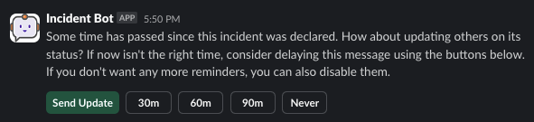
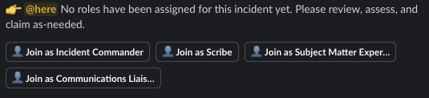
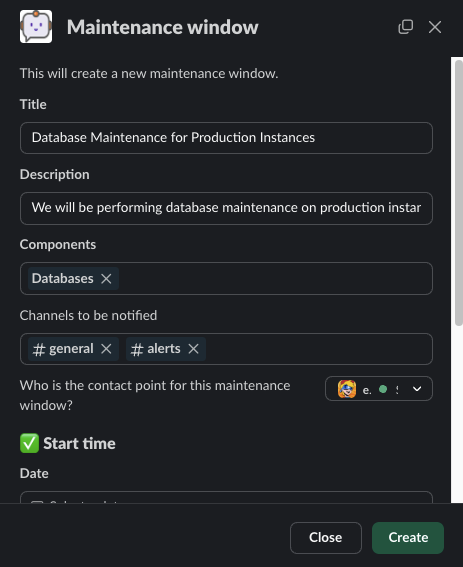
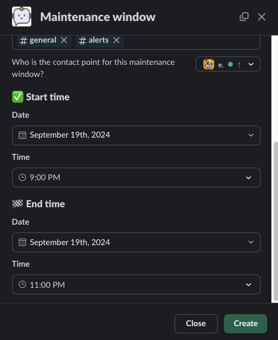
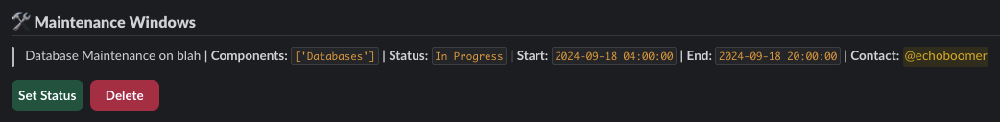
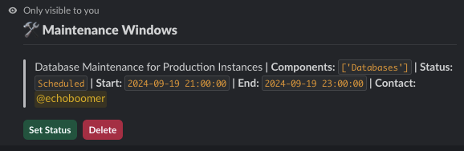
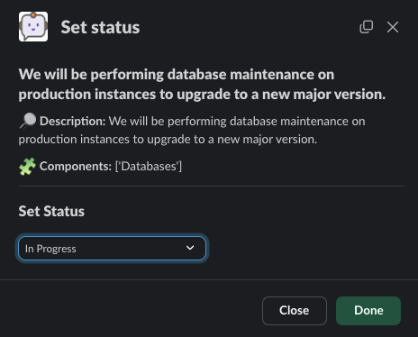
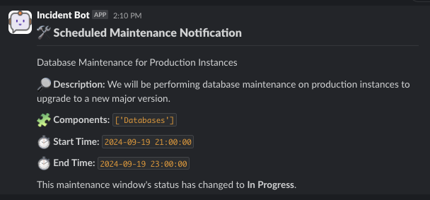

# Features

## Communications Reminder & Role Watcher

For all newly created incidents, the bot will wait for a configurable amount of time, `30 minutes` by default, before sending a reminder about keeping others up to date regarding the incident:

You can dismiss this message or cancel it.

The bot will also send out a reminder if roles have remained unclaimed:

## Maintenance Windows

Maintenance windows are an optional feature. If enabled, the bot will allow the creation of scheduled maintenance windows to describe things that a team will be doing as part of scheduled operations. These notifications will be sent to a list of channels automatically during updates.

This is useful if you don't have a formal system in place for handling maintenance window notifications.

If enabled, there's a button on the bot's home screen that prompts for creating a maintenance window. If you choose this option, you're presented with the following modal:

Once submitted, the bot will let you know the maintenance window was created.

From here, you can view any maintenance windows that are not marked as `Complete` from the app home screen:

Or you can use the bot's slash command `maintenance` subcommand to work with maintenance windows by running `/incidentbot maintenance`:

When you're ready to change a maintenance window's status, click on `Set Status` in either location:

