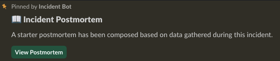
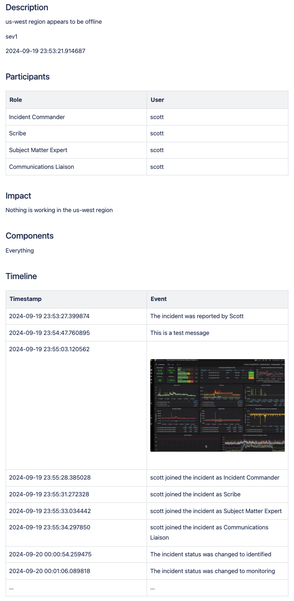
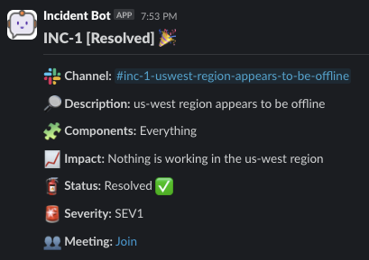
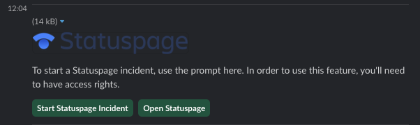
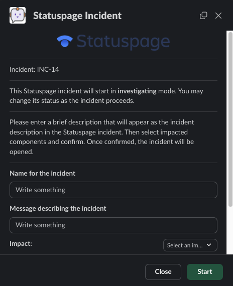
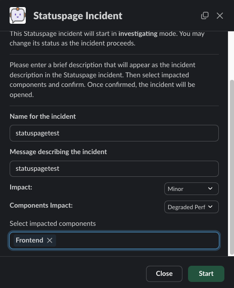
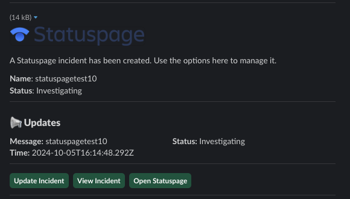
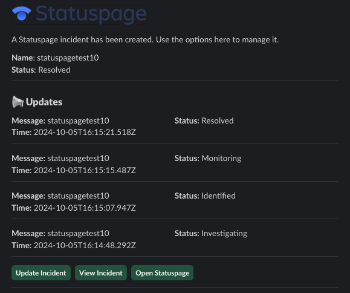

# Integrations

Incident Bot features several integrations to help with automation at critical junctures during the incident management process.

## Atlassian

The bot supports the following Atlassian products:

- Confluence
- Jira
- Opsgenie
- Statuspage

To start with any of these integrations, you'll need an API token for your Atlassian account. The token can be created [here](https://id.atlassian.com/manage-profile/security/api-tokens).

Provide the following environment variables to the bot:

- `ATLASSIAN_API_URL` - The URL of the Atlassian account.
- `ATLASSIAN_API_USERNAME` - Username that owns the API token.
- `ATLASSIAN_API_TOKEN` - The API token.

### Confluence

You are required to provide a [template](https://support.atlassian.com/confluence-cloud/docs/create-a-template/) ID for the bot to use - the bot will not create a page that is not based on a template. If you do not provide a template, the bot will not create a postmortem document.

See the configuration section on [statuses](configuration.md#statuses) to understand how to configure a qualifying status to trigger postmortem generation.

#### Using the Confluence Integration

The bot makes the following information from each incident available for each postmortem document using injection flags:

- `!ib-inject-components`
- `!ib-inject-created-at`
- `!ib-inject-description`
- `!ib-inject-duration`
- `!ib-inject-impact`
- `!ib-inject-participants`
- `!ib-inject-severity`
- `!ib-inject-updated-at`

To use these, simply add these flags to your template. For example - this is a fully valid template for a Confluence postmortem document:


```markdown
## Description

!ib-inject-description

!ib-inject-severity

!ib-inject-created-at

## Participants

!ib-inject-participants

## Impact

!ib-inject-impact

## Components

!ib-inject-components

## Timeline

!ib-inject-timeline
```

The bot would replace each call to an injection flag with the content for that flag. In the end, you'll have a document rendered using your template with the referenced flags replaced by actual content.

#### Configurating the Confluence Integration

In the application's `config.yaml`, you can set the Confluence space and parent page and Jira settings using the `integrations` section:

!!! warning

    You must provide all of these values in order for the integration to work. There are no default values for integrations.

```yaml
integrations:
  atlassian:
    confluence:
      enabled: true
      auto_create_postmortem: true
      parent: Postmortems
      space: ENGINEERING
      template_id: 12345678
```

If the integration is properly configured, when an incident is set to its `final` status, you'll see a notification in the channel regarding the creation of a postmortem document:

{: style="width:500px"}

If you've used the appropriate flags in your document, data should be populated. Here's a very basic example showing how this works:

{: style="height:1400px"}

Here's the incident that postmortem references for comparison:

{: style="width:500"}

### Jira

The bot can open a Jira issue when an incident is created. You can optionally create any number of additional Jira issues directly from an incident.

#### Using the Jira Integration

In the `jira` section, the `project` field is required. All other fields are optional.

If you do not provide `issue_types` or `priorities`, the bot will attempt to automatically fetch them from Jira. If this fails, you will need to provide them manually. Failure is often the result of too many items being returned from the Atlassian API and a limitation in Slack on how many items a single message can contain.

It is recommended to provide these manually if you wish to control them more.

#### Issue Types

This is a list of strings. This will populate the list of selectable issue types when creating a Jira ticket. These **must** be valid options for issue types in your Jira environment.

#### Priorities

This is a list of strings. This will populate the list of selectable priorities when creating a Jira ticket. These **must** be valid options for priorities in your Jira environment.

#### Controlling Creation

In the `jira` configuration section seen below, you can control whether or not an issue is created when an incident is started using the following options:

```yaml
auto_create_issue: true
auto_create_issue_type: Task
```

This would create a Task when an incident is opened containing the name of the incident.

#### Configurating the Jira Integration

In the application's `config.yaml`, you can adjust `jira` settings using the `integrations` section:

!!! warning

    You must provide all of these values in order for the integration to work. There are no default values for integrations.

```yaml
integrations:
  atlassian:
    jira:
      enabled: true
      auto_create_issue: true
      auto_create_issue_type: Task
      project: KAN
      issue_types: ['Task', 'Epic']
      labels:
        - incident-management
      status_mapping:
        - incident_status: Investigating
          jira_status: Open
        - incident_status: Identified
          jira_status: In Progress
        - incident_status: Monitoring
          jira_status: In Review
        - incident_status: Resolved
          jira_status: Done
```

### Opsgenie

You can integrate with Opsgenie to create incidents. To start, you'll need an API integration key for your Opsgenie account. You should also have at least one Opsgenie team created to alert for pages.

!!! warning

    If you're using Opsgenie's **Free** or **Essentials** plan or if you’re using Opsgenie with Jira Service Management's Standard plan, you can add this integration from your team dashboard only. The Integrations page under Settings is not available in your plan. 

In short, you can only create an API integration for a team if on one of these plans. The drop down when creating an alert will only ever show this team as the recipient. If you wish to use more than one team, you will need to upgrade to a compatible plan and provide an organization-wide key.

!!! warning

    Note that keys attached to an API integrations created for a specific team are not the same as the API key created for an Opsgenie organization within global settings. While you can create this key, it will not work to provide functionality for creating alerts.

For additional information, review [this](https://support.atlassian.com/opsgenie/docs/create-a-default-api-integration/) article.

Provide the following variables depending on your setup:

- `ATLASSIAN_OPSGENIE_API_KEY` - Required if creating an org-wide API integration.
- `ATLASSIAN_OPSGENIE_API_TEAM_INTEGRATION_KEY` - Required if if using free or essentials tier plans.

#### Configurating the Opsgenie Integration

In the application's `config.yaml`, you can adjust `opsgenie` settings using the `integrations` section:

!!! warning

    You must provide all of these values in order for the integration to work. There are no default values for integrations.

```yaml
integrations:
  atlassian:
    opsgenie:
      enabled: true
      team: oncalls
```

### Statuspage

You can integrate with Statuspage to automatically prompt for Statuspage incident creation for new incidents. You can also update them directly from Slack.

Provide the following environment variables:

- `STATUSPAGE_API_KEY` - Statuspage API key.
- `STATUSPAGE_PAGE_ID` - Statuspage page ID.

#### Configurating the Statuspage Integration

In the application's `config.yaml`, you can adjust `statuspage` settings using the `integrations` section:

!!! warning

    You must provide all of these values in order for the integration to work. There are no default values for integrations.

```yaml
integrations:
  atlassian:
    statuspage:
      enabled: true
      url: https://status.mydomain.com
```

You can optionally add groups under the `permissions.groups` heading to limit who can create and manage Statuspage incidents from Slack. Anyone not in one of these groups will get an ephemeral message indicating they do not have the required permissions.

#### Using the Statuspage Integration

With the integration enabled, a new incident will prompt for the creation of a Statuspage incident:

{: style="width:600px"}

Fill out the required information to create a Statuspage incident:

{: style="width:500px"}

{: style="width:500px"}

You can use the buttons to provide updates. The message will be updated indicating updates applied to the ongoing incident:

{: style="width:600px"}

{: style="width:600px"}

## PagerDuty

You can integrate with PagerDuty to issue pages to teams. Set the following environment variables:

- `PAGERDUTY_API_TOKEN`
- `PAGERDUTY_API_USERNAME`

In the application's `config.yaml`, you can set the PagerDuty integration to active by setting `enabled` to `true`:

```yaml
pagerduty:
  enabled: true
```

You are then able to use the bot's pager options. These are introduced at various points through the incident management process.

## Zoom

The bot can automatically create a Zoom meeting for each new incident.

If you want to automatically create an instant Zoom meeting for each incident, use the following steps to create a Zoom app and enable the integration:

1. Visit [https://marketplace.zoom.us/develop/create](https://marketplace.zoom.us/develop/create).
2. Create a Server-to-Server OAuth app.
3. Fill out the required generic information.
4. Add scope for View and manage all user meetings.
5. Activate app.
6. Add account ID, client ID, and client secret to env vars below.

!!! warning

    The account ID can be viewed on the app's page in the Zoom Marketplace developer app after it has been activated.

Provide the following environment variables:

- `ZOOM_ACCOUNT_ID` - Account ID from the step above.
- `ZOOM_CLIENT_ID` - The OAuth app client ID from the step above.
- `ZOOM_CLIENT_SECRET` - The OAuth app client secret from the step above.

#### Configurating the Zoom Integration

In the application's `config.yaml`, you can adjust `zoom` settings using the `integrations` section:

!!! warning

    You must provide all of these values in order for the integration to work. There are no default values for integrations.

```yaml
zoom:
  enabled: true
  auto_creating_meeting: true
```
