# Integrations

Incident Bot feature several integrations to help with automation at critical junctures during the incident management process.

Check out these sections to learn more about the integrations, how to enable and configure them, and how to use them.

## Jira and Confluence

It is possible to automatically create a postmortem document when an incident is transitioned to `resolved` status. This only works with Confluence Cloud at this time.

There is also the ability to create issues in Jira related to an incident.

To start, you'll need an API token for your Atlassian account. The token can be created [here](https://id.atlassian.com/manage-profile/security/api-tokens).

Provide the following environment variables:

- `ATLASSIAN_API_URL` - The URL of the Atlassian account.
- `ATLASSIAN_API_USERNAME` - Username that owns the API token.
- `ATLASSIAN_API_TOKEN` - The API token.

In the application's `config.yaml`, you can set the Confluence space and parent page and Jira settings using the `integrations` section:

```yaml
integrations:
  atlassian:
    confluence:
      auto_create_postmortem: true
      space: ENG
      parent: Postmortems
    jira:
      project: INCMGMT
      issue_types: ['Task', 'Epic', 'Story']
      priorities: ['High', 'Medium', 'Low']
      labels:
        - incident-management
        - etc
```

This is only an example - you'll obviously need to provide your own information here.

### Using the Confluence Integration

When enabled, a postmortem document will be created in Confluence with starting information. In general, no additional participation is required to generate this document.

If you use the pinned items feature, those will automatically be added to the document.

There is also a timeline feature accessible using the `/timeline` shortcut in Slack.

All fields are **required** for this section.

### Using the Jira Integration

In the `jira` section, the `project` field is required. All other fields are optional.

If you do not provide `issue_types` or `priorities`, the bot will attempt to automatically fetch them from Jira. If this fails, you will need to provide them manually. Failure is often the result of too many items being returned from the Atlassian API and a limitation in Slack on how many items a single message can contain.

It is recommended to provide these manually if you wish to control them more.

#### Issue Types

This is a list of strings. This will populate the list of selectable issue types when creating a Jira ticket. These **must** be valid options for issue types in your Jira environment.

#### Priorities

This is a list of strings. This will populate the list of selectable priorities when creating a Jira ticket. These **must** be valid options for priorities in your Jira environment.

#### Additional Information

When an incident is created and the Jira integration is enabled, you'll see an option in the incident channel management section to create a Jira issue:

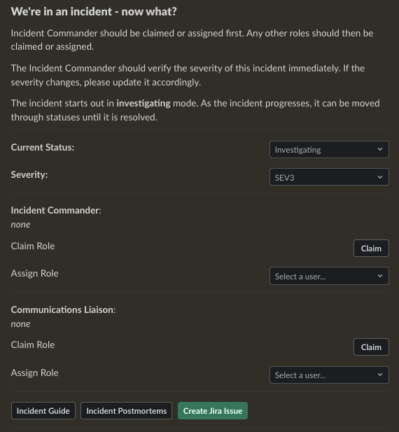

Once you click this button, you'll be prompted for some information to create the issue:

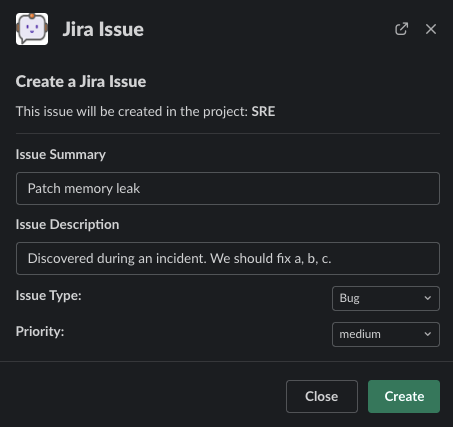

When the issue is created, a message is posted and pinned to the incident channel. This is also visible from the shortcut menu:

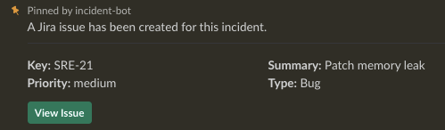

You can view issues in the channel history or from the pinned items menu a tthe top of the incident channel:

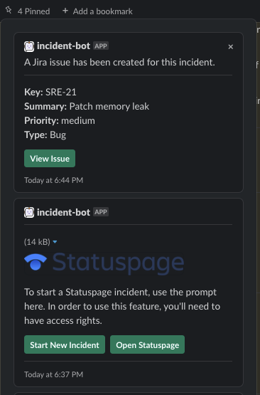

## Opsgenie

You can integrate with Opsgenie to create incidents. To start, you'll need an API integration key for your Opsgenie account. You should also have at least one Opsgenie [Team](https://echoboomer-test.app.opsgenie.com/teams/list) created to alert for pages.

!!! warning

    If you're using Opsgenie's **Free** or **Essentials** plan or if you’re using Opsgenie with Jira Service Management's Standard plan, you can add this integration from your team dashboard only. The Integrations page under Settings is not available in your plan. 

In short, you can only create an API integration for a team if on one of these plans. The drop down when creating an alert will only ever show this team as the recipient. If you wish to use more than one team, you will need to upgrade to a compatible plan and provide an organization-wide key.

!!! warning

    Note that keys attached to an API integrations created for a specific team are not the same as the API key created for an Opsgenie organization within global settings. While you can create this key, it will not work to provide functionality for creating alerts.

For additional information, review [this](https://support.atlassian.com/opsgenie/docs/create-a-default-api-integration/) article.

Provide the following variables depending on your setup:

- `ATLASSIAN_OPSGENIE_API_KEY` - Required if creating an org-wide API integration.
- `ATLASSIAN_OPSGENIE_API_TEAM_INTEGRATION_KEY` - Required if if using free or essentials tier plans.

In the application's `config.yaml`, you can set the Opsgenie integration to active by providing a blank dict with the optional `team` field if needed:

```yaml
integrations:
  atlassian:
    opsgenie: {}
    # team: my-team
```

## PagerDuty

You can integrate with PagerDuty to provide details about who is on call and page teams either manually or automatically. To do so, provide the following variables. If either of these is blank, the feature will not be enabled.

- `PAGERDUTY_API_TOKEN`
- `PAGERDUTY_API_USERNAME`

In the application's `config.yaml`, you can set the PagerDuty integration to active by providing a blank dict:

```yaml
integrations:
  pagerduty: {}
```

You are then able to use the bot's `pager` command and paging-related shortcuts as well as the web features related to them.

### Using the PagerDuty Integration

!!! warning

    You will need to have services and escalation policies defined for this integration to function.

You can issue a page by searching for the `pager` command:

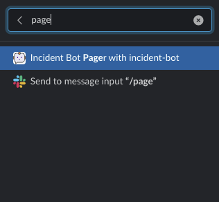

Once the modal pops up, you'll need to fill out some information:

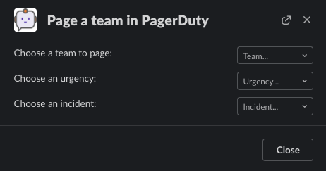

When the last field is selected, the modal will change to ask you to confirm the pending operation:

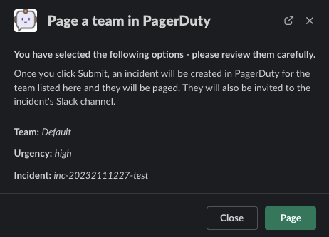

Once a page is issued, the team is paged within PagerDuty where an incident is created:

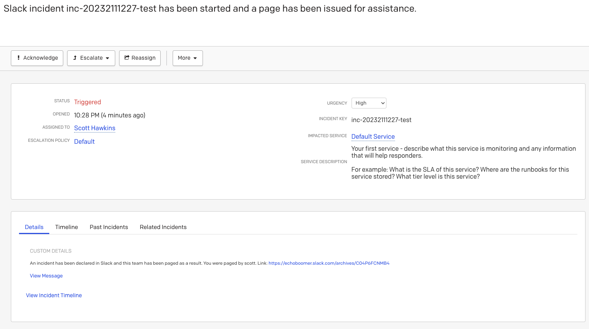

A message is also sent to the incident channel to let everyone know the page has been issued:

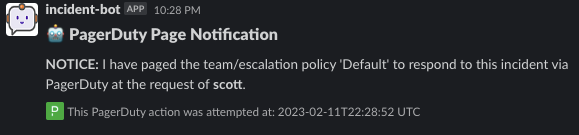

## Statuspage

You can integrate with Statuspage to automatically prompt for Statuspage incident creation for new incidents. You can also update them directly from Slack.

Provide the following environment variables:

- `STATUSPAGE_API_KEY` - Statuspage API key if enabling.
- `STATUSPAGE_PAGE_ID` - Statuspage page ID if enabling.
- `STATUSPAGE_URL` - Link to the public Statuspage for your organization. **Note:** This must be a fully formed URL - example: `https://status.foo.com`.

In the application's `config.yaml`, you can set the Statuspage integration to active by providing the heading and a key that indicates what URL to lead others to to view your incidents:

```yaml
integrations:
# Enable Statuspage integration
  statuspage:
    # The public URL of the Statuspage.
    url: https://status.mydomain.com
    # Which Slack groups have permissions to manage Statuspage incidents?
    # If not provided, everyone can manage Statuspage incidents from Slack.
    permissions:
      groups:
        - my-slack-group
```

You can optionally add groups under the `permissions.groups` heading to limit who can create and manage Statuspage incidents from Slack. Anyone not in one of these groups will get an ephemeral message indicating they do not have the required permissions.

### Using the Statuspage Integration

When the integration is properly configured and enabled, all new incidents will feature a pinned message prompting for the creation of a Statuspage incident:

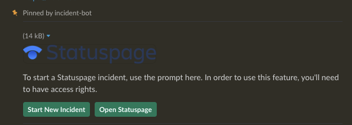

Click on `start new incident` within the Statuspage prompt and then fill out the required information in the modal:

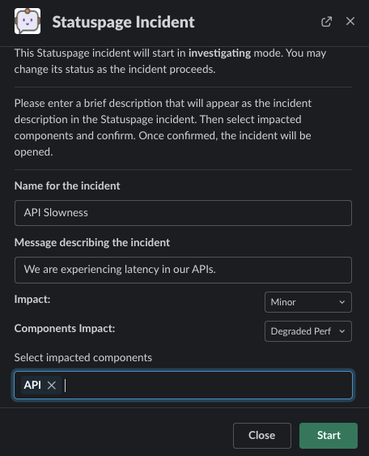

Once an incident is created, the original pinned message will update to reflect current status. You can use this message to continue changing status and providing updates and view the incident:

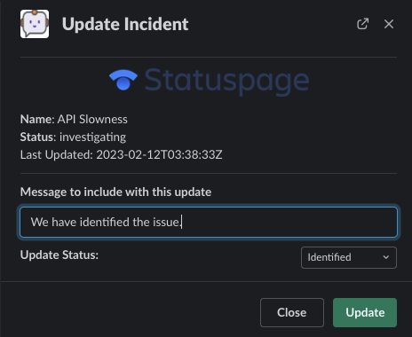

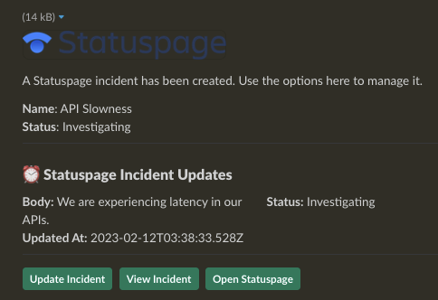

Once the incident is resolved, the message will reflect all status updates:

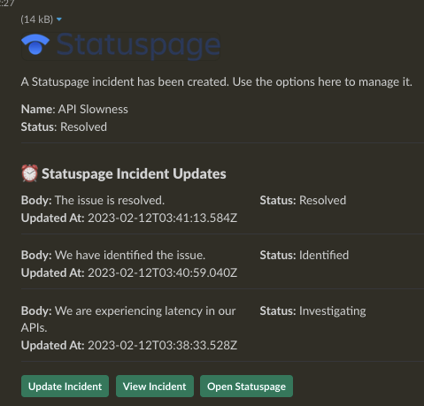

You can see that each of these steps was reflected on Statuspage:

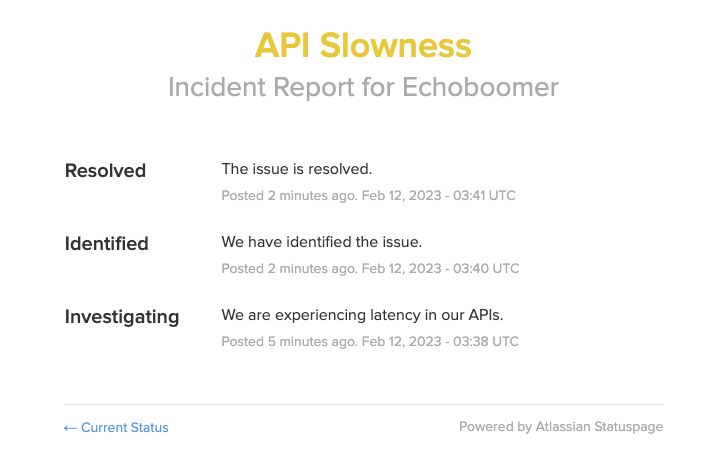

## Zoom

At this time, the bot can automatically create a Zoom meeting for each new incident. In the future, other platforms may be supported.

If you want to automatically create an instant Zoom meeting for each incident, use the following steps to create a Zoom app and enable the integration:

1. Visit [https://marketplace.zoom.us/develop/create](https://marketplace.zoom.us/develop/create).
2. Create a Server-to-Server OAuth app.
3. Fill out the required generic information.
4. Add scope for View and manage all user meetings.
5. Activate app.
6. Add account ID, client ID, and client secret to env vars below.

!!! warning

    The account ID can be viewed on the app's page in the Zoom Marketplace developer app after it has been activated.

Provide the following environment variables:

- `ZOOM_ACCOUNT_ID` - Account ID from the step above.
- `ZOOM_CLIENT_ID` - The OAuth app client ID from the step above.
- `ZOOM_CLIENT_SECRET` - The OAuth app client secret from the step above.

In the application's `config.yaml`, you can set the Zoom integration to active by providing the heading and the value:

```yaml
integrations:
  zoom:
    auto_create_meeting: true
```

When enabled, the meeting link will be a dynamically-generated Zoom link:

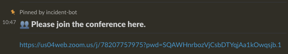

If you set `options.channel_topic.set_to_meeting_link` to `true`, the dynamic Zoom link will also appear in the channel topic.

```yaml
options:
  channel_topic:
    default: 'This is the default incident channel topic. You can edit it in settings.'
    set_to_meeting_link: true
```

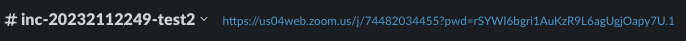

Note that regardless of what the meeting link is, it is always accessible from the digest channel message without needing to join the incident channel:

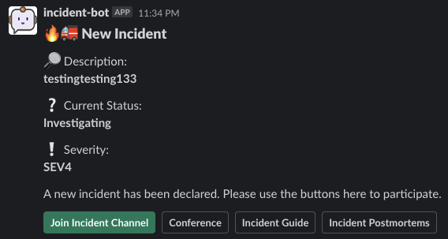
