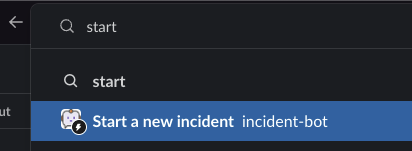
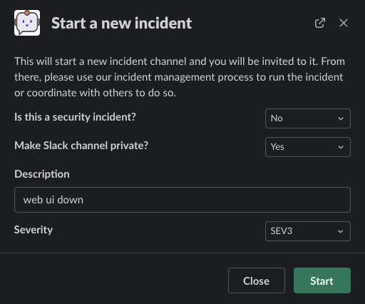
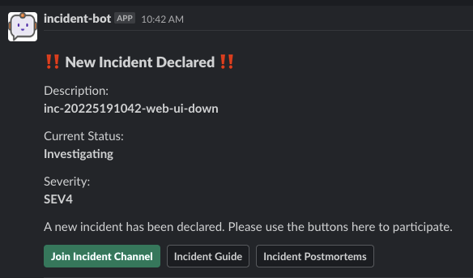
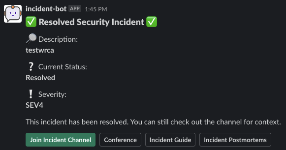

Examples
=====

.. _examples:

Demonstration
------------

Search for the `start a new incident` shortcut via the Slack search bar and click on it:

Provide a short description and start a new incident:

The digest channel shows that a new incident has been started:

Upon joining the incident channel, the control panel is show where changes can be made to `status`, `severity`, and `roles`:

As `status`, `severity`, and `roles` are changed, the channel is notified of these events:

Periodically, you can choose to provide those not involved directly in the incident about updates by searching for the `provide incident update` shortcut via the Slack search bar and clicking on it:

You can then provide details regarding components and the nature of the update after selecting the incident channel. Only open incidents will show up in the list:

.. image:: examples/provide-update-modal.png

Now, everyone can see the updates in the digest channel without needing to join the incident:

.. image:: examples/provide-update-message.png

When an incident is promoted to `sev2` or `sev1`, the scheduled reminder to send out updates will be created. You can view these by using `scheduler list`:

.. image:: examples/sev2-scheduler.png

When an incident has reached its conclusion and has been resolved, a helpful message is sent to the incident channel - notice that there is a handy button to export a formatted chat history to attach to your postmortem:

.. image:: examples/resolution-message.png

The original message in the digest channel is changed to reflect the new status of the incident:

This is only a simple explanation of the process for running an incident. There are plenty of features that will guide your teams along the way.
