# Usage Guide

## Interacting

The main method of interacting with the bot is via its slash command - `/incidentbot` by default.

Type `/incidentbot` (or whatever you've set the slash command to) in any channcel to get a prompt:

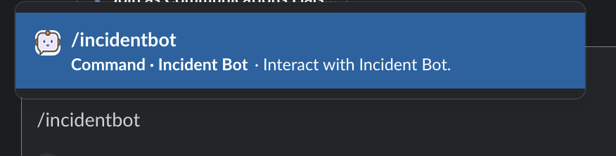{: style="width:400px"}

Once you hit `return`, you'll be presented with the core prompt:

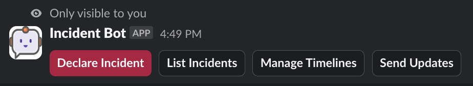{: style="width:500px"}

From here you can declare an incident, list all incidents, manage incident timelines, or send out incident updates.

## Running Incidents

### Starting an Incident

Use the `Declare Incident` option via the bot prompt and you'll be issued the modal to declare an incident:

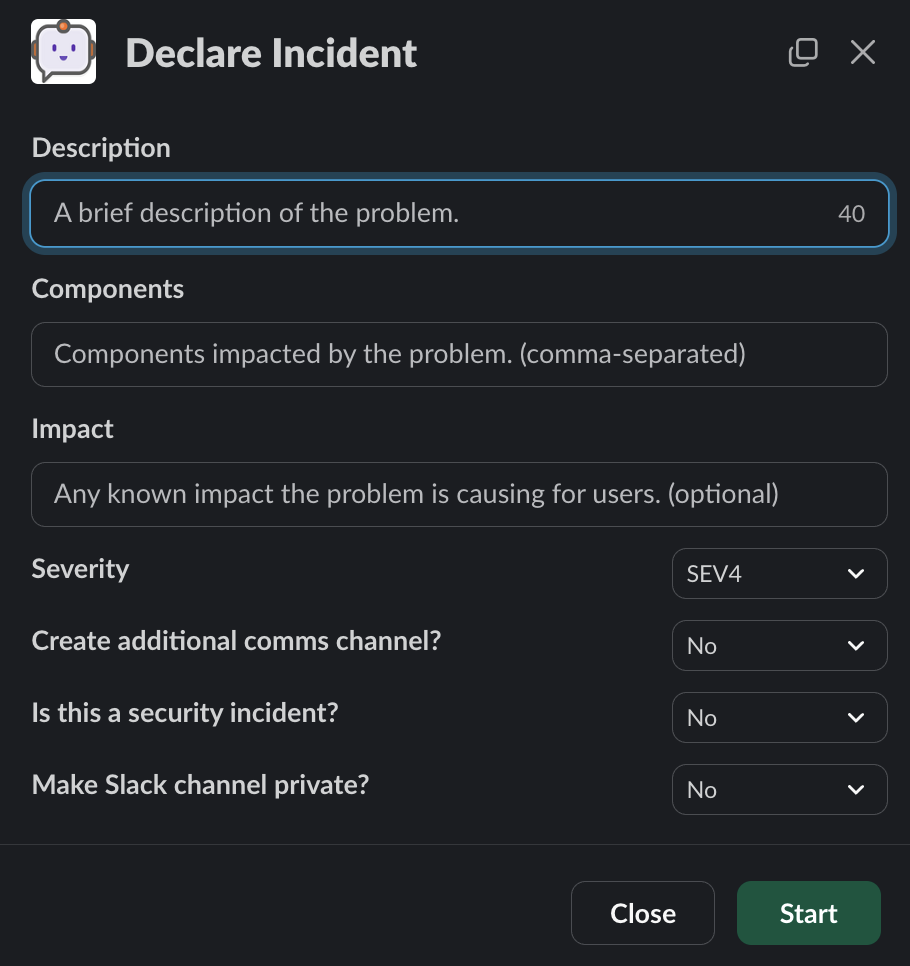{: style="width:400px"}

Provide information as-needed and hit `Start` to kick off the incident management process for this new incident.

### Managing an Incident

The digest channel shows the status of any incident:

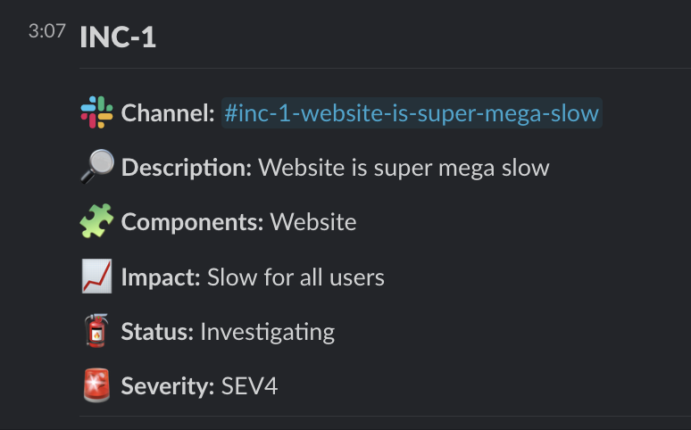{: style="width:500px"}

When an incident has a meeting link:

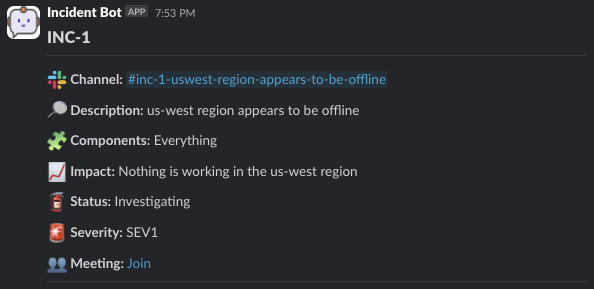{: style="width:600px"}

When an incident is resolved:

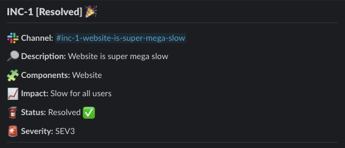{: style="width:600px"}

From here, anyone can see the status of any incident at any time and join it if they choose to.

All new incidents receive a welcome message with context on things to do at the start of an incident:

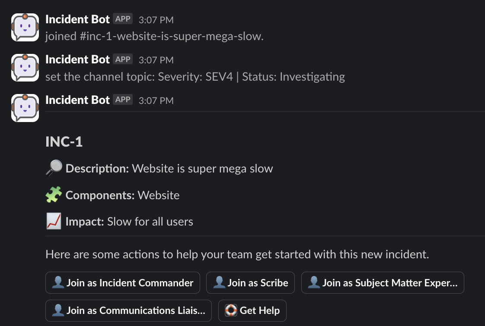{: style="width:500px"}

If the Jira integration is enabled, you'll see an option to create a Jira issue:

{: style="width:500px"}

From here, one can pick up a role by clicking on the role buttons:

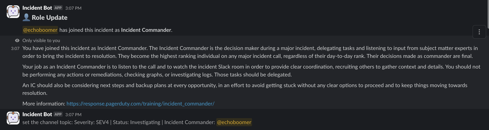

The channel will be notified about the role being assigned. The person accepting the role will be sent information on what the role entails. These messages are customizable.

At any time, you can use the `Describe` function to output a message that describes all current incident parameters, including assigned roles:

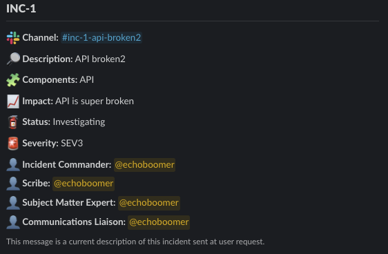{: style="width:600px"}

#### Interacting Directly

The bot contains a subcommand called `this`. Running `/incidentbot this` will provide a prompt to interact with an incident:

!!! warning

    The `this` subcommand only works within an incident channel.

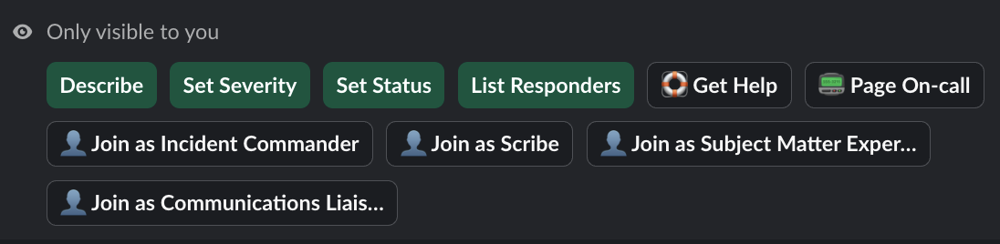{: style="width:500px"}

From here, you can:

Set severity:

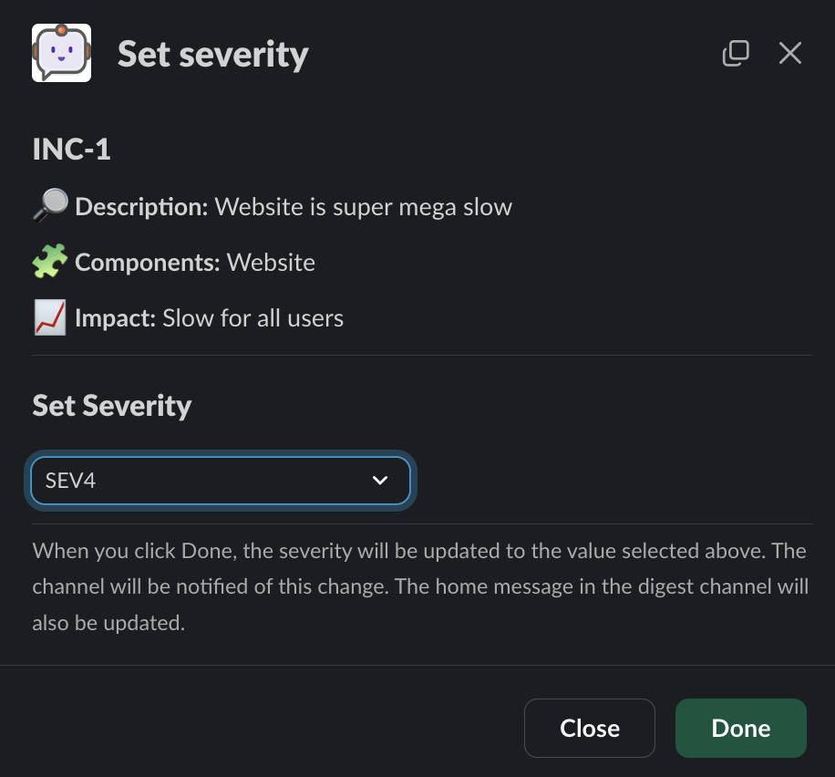{: style="width:400px"}

Set status:

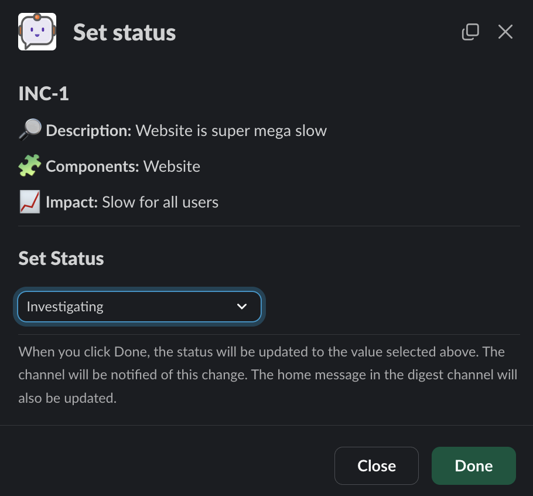{: style="width:400px"}

List responders:

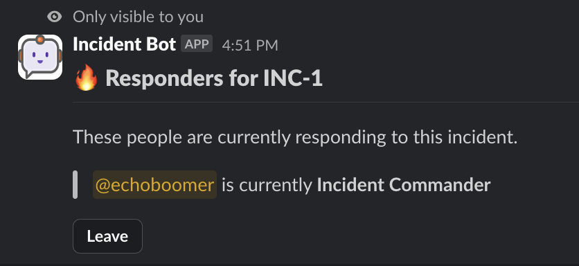{: style="width:400px"}

!!! note

    With the `List Responders` option, you have the option to leave a role if you're currently assigned to it. You cannot remove others.

Get help:

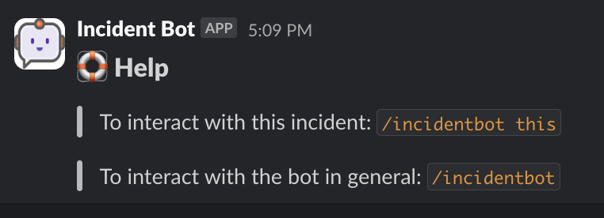{: style="width:400px"}

...and various other features depending on what is enabled.

## App Home

You can click on Incident Bot in the Slack sidebar to go to the app home:

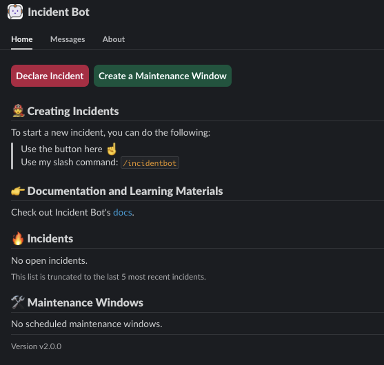{: style="width:500px"}

From here, you can declare an incident, create a maintenance window (if enabled), see open incidents, and see any maintenance windows.
