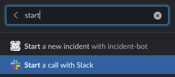
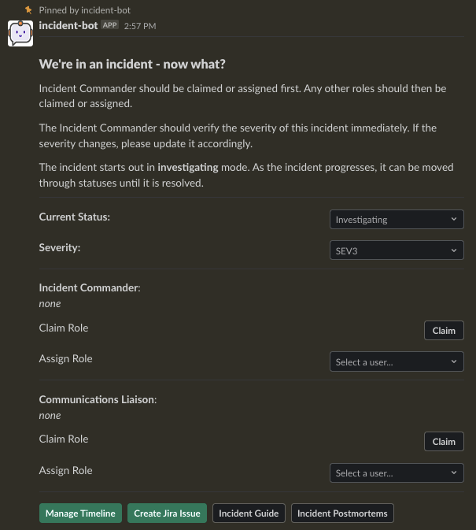
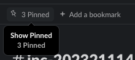
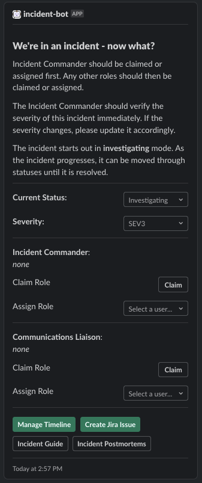
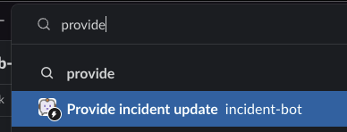
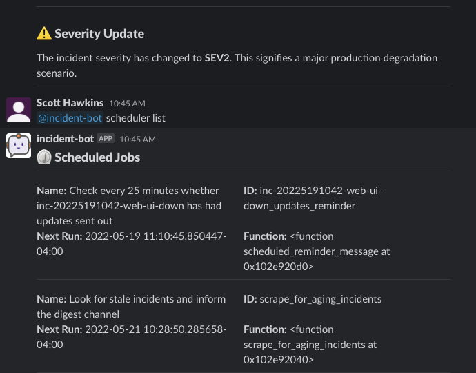
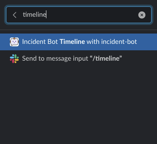
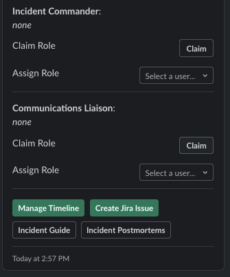
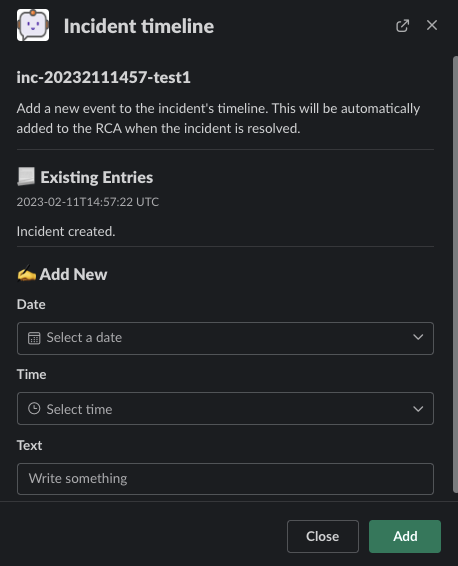
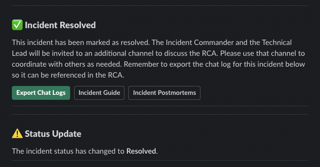

# Usage Guide

## Starting an Incident

Search for the `start a new incident` shortcut via the Slack search bar and click on it:

Provide a short description and fill out some other info to start the incident:

## Managing an Incident

The digest channel shows that a new incident has been started:

Upon joining the incident channel, the control panel is shown where changes can be made to `status`, `severity`, and `roles` along with other settings:

Regardless of where you are within an incident channel, you can use the pinned messages shortcut to access the management message without scrolling back to the top:

As `status`, `severity`, and `roles` are changed, the channel is notified of these events:

Periodically, you can choose to provide those not involved directly in the incident about updates by searching for the `provide incident update` shortcut via the Slack search bar and clicking on it:

You can then provide details regarding components and the nature of the update after selecting the incident channel. Only open incidents will show up in the list:

Now, everyone can see the updates in the **digest channel** without needing to join the incident:

When an incident is promoted to `sev2` or `sev1`, the scheduled reminder to send out updates will be created. You can view these by using `scheduler list`:

### Manage an Incident's Timeline

Search for the `start a new incident` shortcut via the Slack search bar and click on it:

You can also access the timeline management modal via the pinned incident management message:

Once the modal is open, select an incident from the dropdown and you can see existing timeline entries. You can also add your own:

This timeline is automatically added to the postmortem document. You can remove entries from it using the web UI.

## Resolving an Incident

When an incident has reached its conclusion and has been resolved, a helpful message is sent to the incident channel - notice that there is a handy button to export a formatted chat history to attach to your postmortem:

The original message in the digest channel is changed to reflect the new status of the incident:

This is only a simple explanation of the process for running an incident. There are plenty of features that will guide your teams along the way.

## Integrations

To get information on how to use integrations, check out the [integrations](/integrations/) documentation.
